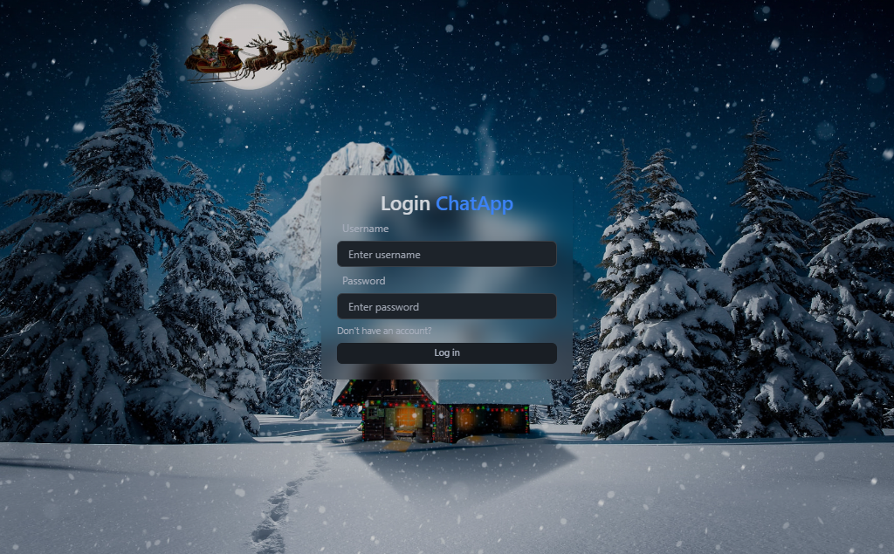
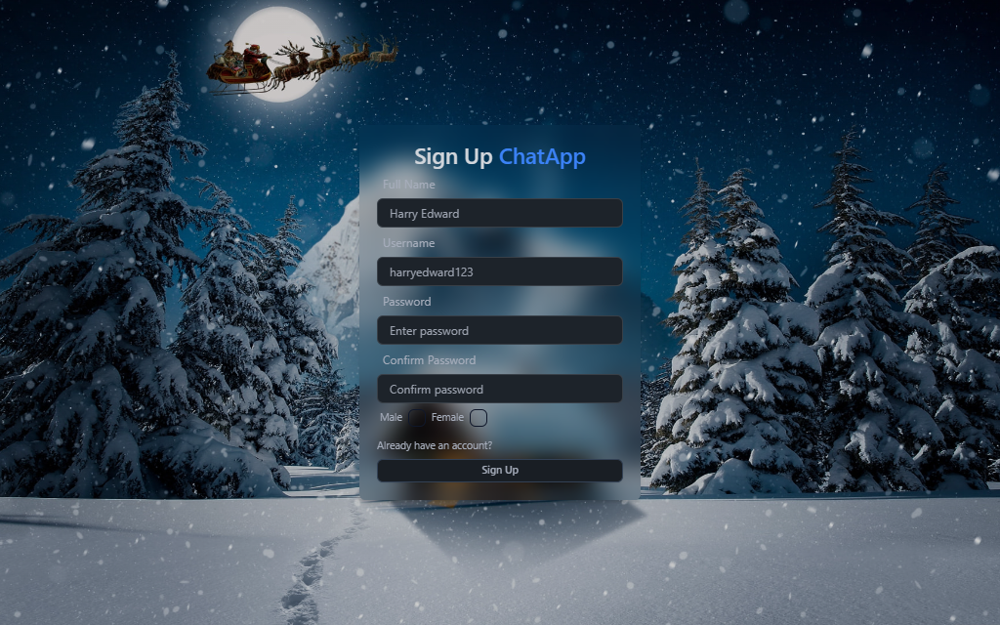
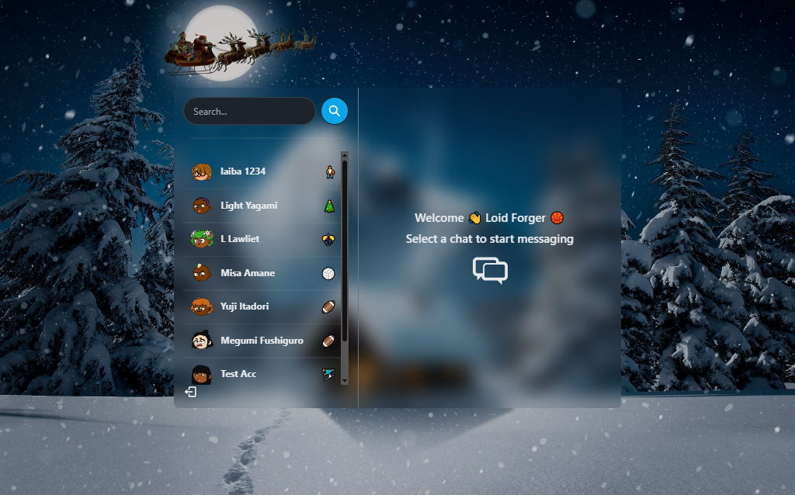
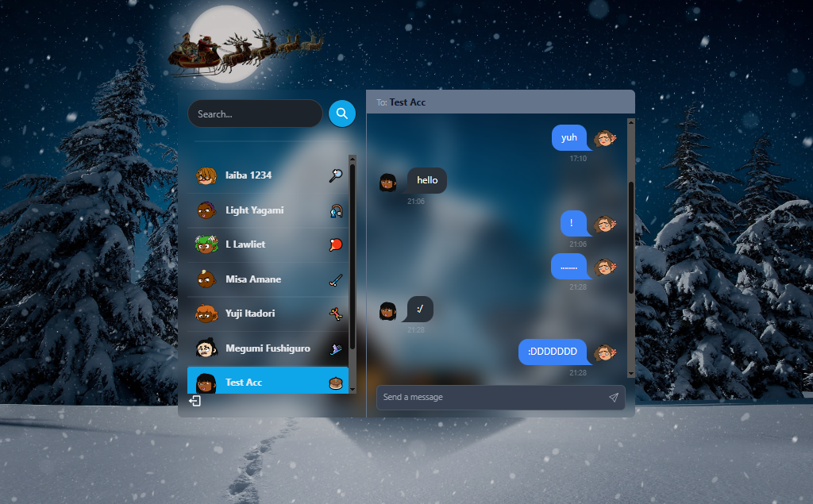

# MERN Chat App

A simple real-time chat application built with the MERN stack.

## Preview

Live demo: [https://mern-chat-app-z0tw.onrender.com/](https://mern-chat-app-z0tw.onrender.com/)

## Screenshots

### Login Page



### Sign Up Page



### Home Page



### Chat Selected



## Features

- User signup and login
- JWT authentication with cookies
- One-to-one messaging
- Real-time message updates with Socket.IO
- Online users indicator
- Conversation sidebar with search
- Responsive chat interface

## Tech Stack

- MongoDB
- Express
- React
- Node.js
- Socket.IO
- Tailwind CSS
- DaisyUI
- Zustand

## Project Structure

```text
chat-app/
|-- backend/
|-- frontend/
|-- screenshots/
|   |-- chat-home.png
|   |-- login-page.png
|   `-- signup-page.png
|-- package.json
`-- README.md
```

## Local Setup

1. Clone the repository.
2. Install root dependencies:

```bash
npm install
```

3. Install frontend dependencies:

```bash
cd frontend
npm install
```

4. Create a `.env` file in the root with:

```env
PORT=5000
MONGO_DB_URI=your_mongodb_connection_string
JWT_SECRET=your_jwt_secret
NODE_ENV=development
```

5. Start the backend:

```bash
npm run server
```

6. Start the frontend in a second terminal:

```bash
cd frontend
npm run dev
```

## Build

```bash
npm run build
npm start
```

## Notes

- The production frontend is served from the Express backend.
